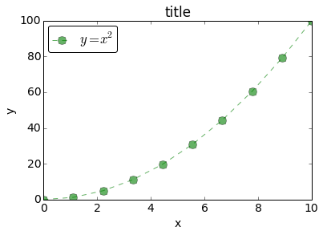
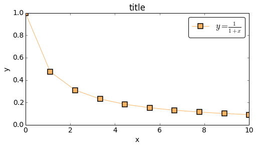

#easyplot
**easyplot:** A matplotlib wrapper written in Python to enable fast and easy
creation of reusable plots.

by [Sudeep Mandal](http://www.sudeepmandal.com)

The EasyPlot module provides a thin wrapper to matplotlib, enabling fast and
easy generation of beautiful, annotated plots with minimal code. It also enables
the reuse of EasyPlot instances to generate new plots that maintain state from
previous plots allowing for quick and easy generation of multiple plots of a
similar type. EasyPlot supports all commonly used plot parameters and allows
access to the underlying figure and axes instances to allow the user to further
customize the generated plots if necessary.
<hr>
I'd love to hear your comments and/or suggestions. You can get in touch with me
via [twitter](https://twitter.com/hamsterhuey),
[email](mailto:sudeepmandal@gmail.com) or
[google+](https://plus.google.com/u/0/105292596991480463202/)
<hr>

<a name="sections"></a>

##Sections
- [Requirements](#requirements)
- [Installation](#installation)
- [Motivation and Background](#motivation)
- [Features](#features)
- [Documentation](#documentation)
    - [EasyPlot instance methods](#methods)
    - [EasyPlot instance variables](#variables)
    - [List of supported plot parameters](#plot_params)
    - [Interactive/Non-Interactive plotting mode](#interactive_mode)
- [Usage and Examples](#usage)
    - [Simple Plot](#simple_plot)
    - [Multiple plots in the same figure (Interactive)](#multiple_plots)
    - [Using EasyPlot object as template for new plots](#easyplot_template)
    - [Autoscaling Plots](#autoscale)
    - [Setting background grid](#grid)
    - [Log/Linear/Symlog plots](#log_linear_scale)
    - [Modifying Plot color cycle](#colorcycle)
    - [Multiple plots in same figure iteratively using iter_plot](#iter_plot)
- [Advanced plotting](#advanced_plotting)
    - [Using easyplot with subplots](#subplots)
    - [Custom plot modifications via axes instance](#ax_mods)

<a name="requirements"></a>

##Requirements
- Python 2.7.2+
- matplotlib

Use of the [IPython](http://ipython.org/) shell is strongly recommended with
this library (and matplotlib plotting in general). The `%matplotlib` magic
command in IPython (or starting IPython using `ipython --matplotlib`) implements
a number of backend tweaks to enable robust, interactive plotting using
matplotlib.

<a name="installation"></a>

#Installation
[[back to section overview](#sections)]

You can use the following commands to install EasyPlot:

`pip install easyplot`

or

`easy_install easyplot`

Alternatively, you could download the package manually from the Python Package
Index: https://pypi.python.org/pypi/EasyPlot, unzip it, navigate into the
package, and use the command:

`python setup.py install`

or

`pip install .`

<a name="motivation"></a>

#Motivation and background
[[back to section overview](#sections)]

Setting up aesthetically pleasing plots with plot titles, axes labels, etc
requires several lines of boilerplate code in vanilla matplotlib. As an example,
creating a basic plot in matplotlib requires the following lines of code:
```python
fig, ax = plt.subplots()
ax.plot(x, x**2, 'b-o', label="y = x**2")
ax.plot(x, x**3, 'r--s', label="y = x**3")
ax.legend(loc='best')
ax.grid()
ax.set_xlabel('x')
ax.set_ylabel('y')
ax.set_title('title')
```


Pylab alleviates some of this, but still requires calls to a number of different
functions that are commonly used (such as xlabel, xlim, etc.). More complicated
plots can require several more lines of code. Typing all this code every time to
generate plots gets tedious very quickly. This situation is further exacerbated
when working in an IPython Notebook where all plots typically need to be
labeled, annotated and looking their best. Having several lines of code
preceeding every plot in a notebook can break the flow of the document and
distract from the code/concepts being presented by the author. Furthermore,
oftentimes, plots with similar labels and formatting need to be generated
repeatedly with different datasets. Generating these sets of plots would require
retyping these same lines of boilerplate code across different sections of your
code/notebook.

Easyplot is my attempt to address these issues and make generating quick,
pleasant looking, annotated plots a bit easier. In keeping with [DRY
philosophy](http://en.wikipedia.org/wiki/Don%27t_repeat_yourself), `easyplot`
enables the creation of an `EasyPlot` object that maintains state information of
all plot parameters passed to it in order to generate a plot. This can then be
easily reused to generate new plots with the user only having to supply any
additional plot parameters, or those parameters he or she wishes to override
from the previous plot.

Easyplot supports a large number of standard plot parameters that most users
typically deal with when plotting in matplotlib. Additionally, it provides
methods to access the figure and axes instance for the latest plot, enabling
users to perform more custom plot modifications that are not directly supported
by easyplot. It also supports interactive plotting where additional plot
parameters can be passed to the current plot using the `update_plot` method. The
plot above can be generated using `easyplot` as follows:
```python
eplot = EasyPlot(x, x**2, 'b-o', label='y = x**2', showlegend=True,
                 xlabel='x', ylabel='y', title='title', grid='on')
eplot.add_plot(x, x**3, 'r--s', label='y = x**3')
```
Along with the reduced typing, easyplot enables the consolidation and passing of
all plot parameters into a single plot call. This is already quite handy, but
the real benefit is evident when one needs to generate a new plot with the same
plot parameters (such as axis labels and title) but with new data:
```python
eplot.new_plot(x, 1/x, 'g-D', label='y = 1/x')
```


`EasyPlot` also provides an `iter_plot()` method that iterates through x, y data
and plot parameters that are provided in a list or dictionary format to
automatically generate an annotated, multi-line plot with a single statement:
```python
eplot = EasyPlot(xlabel=r'$x$', ylabel='$y$', fontsize=16,
                 colorcycle=["#66c2a5","#fc8d62","#8da0cb"], figsize=(8,5))
eplot.iter_plot(x, y_dict, linestyle=linestyle_dict, marker=marker_dict,
                label=labels_dict, linewidth=3, ms=10, showlegend=True, grid='on')
```


<a name="documentation"></a>

<a name="features"></a>

#Features
[[back to section overview](#sections)]
- Access to a large number of the most used matplotlib plot parameters under a
unified wrapper class
- Plot parameter aliases supported. Can be extended by user for arbitrary alias
definitions for various plot parameters
- Ability to use `EasyPlot` objects as templates to rapidly generate annotated
plots of a similar type
- `iter_plot()` method to easily iterate through x, y datasets and plot multiple
plots with a single method call
- Draggable legend when using GUI backends (eg: qt, wx, etc.)
- Provides access to underlying figure, axes and line2D objects for advanced
plot customization

<a name="documentation"></a>

#Documentation
[[back to section overview](#sections)]

EasyPlot consists of an `EasyPlot` class to create `EasyPlot()` objects in order
to generate matplotlib plots. The object constructor allows for passing all
commonly used plot parameters (such as `xlabel`, `ylabel`, `title`,
`markersize`, `linewidth`, etc.) and the `x`, `y` data as arguments in order to
generate an annotated plot via a single statement such as:
```python
fftplot = EasyPlot(freq, amplitude, 'g-o', markersize=9, linewidth=3,
                xlabel='Frequency (Hz)', ylabel='Amplitude', label='FFT Data', showlegend=True)
```
If no `x`, `y` data is provided to the `EasyPlot` constuctor, creation of a
figure and axes instance for the `EasyPlot` object is deferred and the plot
parameters that are passed to the constructor are used to initialize the
`EasyPlot` object.

Apart from the usual plot parameters, `EasyPlot` constructor also takes the
following special keyword arguments:

`fig` : an optional reference to a figure object supplied by the user <br/>
`ax` : an optional reference to an axes object (linked to `fig`) to use for
displaying the plots. The [subplots example](#subplots) demonstrates the use of
`fig` and `ax` plot parameters for custom plotting routines <br/>
`figsize` : the size of the plot figure <br/>
`showlegend` : set to True or False to display the plot legend

The `EasyPlot` object also retains state information of most plot parameters
passed to it, thus allowing the object to be reused as a template for generating
new plots with similar formatting/labeling. The only parameters whose values are
not persistent are `color`, `marker`, `linestyle` and `label` as they are
assumed to be unique to a single plot.

`EasyPlot` objects also provide access to their `figure`, `axes` and `Line2D`
instances via the `get_figure()`, `get_axes()` methods and `line_list` instance
variable respectively.

<a name="methods"></a>

### EasyPlot instance methods
The main instance methods for `EasyPlot` objects are:
<hr>
`add_plot(*args, **kwargs)` : This is the main instance method to add additional
plots and plot parameters to an existing plot. `*args` are the typical
matplotlib plot args of the form `(x, y, 'b-o')`. `**kwargs` are a list of named
plot parameters as explained in the [next section](#plot_params).
<hr>
`update_plot(**kwargs)` : Instance method to update plot parameters only
(example: `xlabel`, `title`, etc.). This method is typically only useful when
plotting interactively using an interactive matplotlib backend.
<hr>
`new_plot(*args, **kwargs)` : Create a new plot using the plot parameters of the
existing `EasyPlot` instance as a template (i.e., plot parameter settings carry
over from the `EasyPlot` instance to the new plot)
<hr>
`iter_plot(x, y, mode='dict', **kwargs)` : This method can be used to plot
multiple line/scatter plots with a single statement as long as `x`, `y`, and any
relevant plot parameters that change for each plot are passed in as either a
dictionary with a common set of keys (`mode='dict'`) or a set of lists/arrays
corresponding to each data set to be plotted (`mode='array'`).
<hr>
`autoscale(enable=True, axis='both', tight=None)` : Set autoscale options for
`x`, `y` or `both` axes
<hr>
`grid(**kwargs)` : Equivalent to matplotlib axes.grid() method and accepts same
set of keyword arguments. Enables more custom control over the plot grid.
<hr>
`get_figure()` : Returns reference to the Figure object for the instance
<hr>
`get_axes()` : Returns reference to the axes object for the instance
<hr>
`redraw()` : Forces a redraw of the plot canvas. Must be used if custom
modifications are made to the plot external to easyplot via direct access to the
figure and axes handles. **Note: `redraw()` is only supported when plotting in
interactive mode (i.e. `plt.isinteractive() == True`)**.
<hr>
`set_fontsize(font_size)` : Modify global setting for plot font-size
<hr>

<a name="variables"></a>

### EasyPlot instance variables
The main instance variables for `EasyPlot` objects are:
<hr>
`self.kwargs` : A dictionary containing a list of all existing plot parameters
for an `EasyPlot` object. The user should not modify this directly. This
variable should be accessed in a read-only fashion for the purposes of examining
the state of an `EasyPlot` object.
<hr>
`self.line_list` : A list of [`Line2D`](http://matplotlib.org/1.3.1/api/artist_a
pi.html#matplotlib.lines.Line2D) items corresponding to all plots of the
`EasyPlot` object. These can be manipulated using standard matplotlib methods
outside of `easyplot` for [advaced plotting](#advanced_plotting).

<a name="plot_params"></a>

### List of supported plot parameters
```
Plot Parameters:
----------------
fig : figure instance for drawing plots
ax : axes instance for drawing plots (If user wants to supply axes,
     figure externally, both ax and fig must be supplied together)
figSize : tuple of integers ~ width & height in inches
label : Label for line plot as determined by *args, string
color / c : Color of line plot, overrides format string in *args if
            supplied. Accepts any valid matplotlib color
linewidth / lw : Plot linewidth
linestyle / ls : Plot linestyle ['-','--','-.',':','None',' ','']
marker : '+', 'o', '*', 's', 'D', ',', '.', '<', '>', '^', '1', '2'
markerfacecolor / mfc : Face color of marker
markeredgewidth / mew :
markeredgecolor / mec :
markersize / ms : Size of markers
markevery / mev : Mark every Nth marker
                  [None|integer|(startind, stride)]
alpha : Opacity of line plot (0 - 1.0), default = 1.0
title : Plot title, string
xlabel : X-axis label, string
ylabel : Y-axis label, string
xlim : X-axis limits - tuple. eg: xlim=(0,10). Set to None for auto
ylim : Y-axis limits - tuple. eg: ylim=(0,10). Set to None for auto
xscale : Set x axis scale ['linear'|'log'|'symlog']
yscale : Set y axis scale ['linear'|'log'|'symlog']
    Only supports basic xscale/yscale functionality. Use
    get_axes().set_xscale() if further customization is required
grid : Display axes grid. ['on'|'off']. See grid() for more options
colorcycle / cs: Set plot colorcycle to list of valid matplotlib
                 colors
fontsize : Global fontsize for all plots

Legend Parameters:
------------------
showlegend : set to True to display legend
fancybox : True by default. Enables rounded corners for legend box
framealpha : Legend box opacity (0 - 1.0), default = 1.0
loc : Location of legend box in plot, default = 'best'
numpoints : number of markers in legend, default = 1.0
ncol : number of columns for legend. default is 1
markerscale : The relative size of legend markers vs. original.
              If None, use rc settings.
mode : if mode is “expand”, the legend will be horizontally
       expanded to fill the axes area (or bbox_to_anchor)
bbox_to_anchor : The bbox that the legend will be anchored. Tuple of
                 2 or 4 floats
```

<a name="interactive_mode"></a>

##A note about interactive plotting mode in matplotlib
It is strongly recommended that `EasyPlot` be used in a Python/IPython shell
with interactive matplotlib plotting turned on (`matplotlib.pyplot.ion()` turns
this on). This provides the maximum flexibility when plotting with `EasyPlot`
and also makes it easier to learn and understand the use of this matplotlib
wrapper.  In the case of non-interactive plotting, the blocking nature of
`plt.show()` prevents dynamic modification and further additions to an existing
plot. This issue can be partially alleviated by the `plt.show(block=False)`
method call (this is experimental in Matplotlib).

Note that if non-interactive plotting is the default, the user must call
`plt.show()` after setting up the plot as desired using `EasyPlot`. `add_plot()`
method calls on the EasyPlot instance are not supported after the figure is
closed in non-interactive mode, and the `redraw()` instance method is also not
supported in this mode (user can call `plt.draw()` instead)

<a name="usage"></a>

#Usage and Examples
[[back to section overview](#sections)]


    # Import modules and setup
    %matplotlib inline
    import matplotlib.pyplot as plt
    import numpy as np
    import sys
    sys.path.append('../')
    from easyplot import EasyPlot
    
    x = np.linspace(0, 10, 10)

<a name="simple_plot"></a>

## Simple plot


    eplot = EasyPlot(x, x**2, 'g--o', label=r"$y = x^2$", showlegend=True, xlabel='x',
                     ylabel='y', title='title', fontsize=14, markersize=10, alpha=0.6)





<a name="multiple_plots"></a>

##Multiple plots in same figure (Interactive)
[[back to section overview](#sections)]


    #Note the use of plot parameter aliases and the figsize parameter
    eplot = EasyPlot(x, x**2, label=r"$y = x^2$", figsize=(8,4), showlegend=True, 
                     ncol=2, ms=10, ls=':', markeredgewidth=1.5, xlabel='x',
                     ylabel='y', title='title', color='b', marker='s')
    eplot.add_plot(x, 0.15*x**3, label='$y = 0.15x^3$', c='c', ls='-', marker='D')


<a name="easyplot_template"></a>

##Using EasyPlot object as template for new plots
[[back to section overview](#sections)]

The previous example defined an `EasyPlot` object `eplot` with various plot
parameters set - `xlabel`, `ylabel`, `title`, `alpha`, `ncol`, `markersize` and
`markeredgewidth` . We can examine the current set plot parameters for an
`EasyPlot` object by accessing its `kwargs` instance variable


    #Examine set plot parameters for eplot
    eplot.kwargs

    {'ax': <matplotlib.axes.AxesSubplot at 0x4485650>,
     'dpi': 80,
     'fancybox': True,
     'fig': <matplotlib.figure.Figure at 0x446d8f0>,
     'figsize': (8, 4),
     'loc': 'best',
     'markeredgewidth': 1.5,
     'markersize': 10,
     'ncol': 2,
     'numpoints': 1,
     'showlegend': True,
     'title': 'title',
     'xlabel': 'x',
     'ylabel': 'y'}


Note that certain plot parameters such as `linestyle`, `marker`, `label` and
`color` are considered **unique parameters** and do not carry over from one plot
to another as they are typically unique to a specific plot.

It is easy to use `eplot` as a template to generate a new plot:


    eplot.new_plot(x, 1/(1+x), '-s', label=r"$y = \frac{1}{1+x}$", c='#fdb462')
    # Note that the plot reuses the axis labels, title and marker 
    # formatting from the previous eplot template





<a name="autoscale"></a>

## Autoscaling plots
EasyPlot objects have an `autoscale()` instance method that can be called on the
instance to reset the `xlim` and `ylim` properties to `None` and autoscale the
axes. The method signature is listed below along with the default parameter
values.
```python
def autoscale(self, enable=True, axis='both', tight=None):
    """Autoscale the axis view to the data (toggle).

    Convenience method for simple axis view autoscaling. It turns
    autoscaling on or off, and then, if autoscaling for either axis is on,
    it performs the autoscaling on the specified axis or axes.

    Arguments
    =========
    enable: [True | False | None]
    axis: ['x' | 'y' | 'both']
    tight: [True | False | None]
    """
```

<a name="grid"></a>

## Setting background grid
[[back to section overview](#sections)]

easyplot provides two ways to display the background grid for the axes.
- To display a simple grid without any custom formatting, the plot parameter
`grid='on'` can be passed to the easyplot object. Setting `grid='off'` turns the
grid off.


        eplot.new_plot(x, 1/(1+x), '-s', label=r"$y = \frac{1}{1+x}$", c='#fdb462', grid='on')


- For more advanced control of the grid, the easyplot `grid()` instance method
is provided with a call signature of `grid(self, b=None, which='major',
axis='both', **kwargs)` where `**kwargs` are passed to linespec of grid lines
(eg: linewidth=2)


        eplot.new_plot(x, 1/(1+x), '-s', label=r"$y = \frac{1}{1+x}$", c='#fdb462')
        eplot.grid(which='major', axis='x', linewidth=2, linestyle='--', color='b', alpha=0.5)
        eplot.grid(which='major', axis='y', linewidth=2, linestyle='-', color='0.85', alpha=0.5)


<a name="log_linear_scale"></a>

##Log/Linear/Symlog plots
[[back to section overview](#sections)]

Plot parameters `xscale` and `yscale` can be passed to easyplot instances with
any of the following values: `['linear'|'log'|'symlog']`


    eplot.new_plot(x, 1/(1+x), '-s', label=r"$y = \frac{1}{1+x}$", c='#fdb462', yscale='log')
    eplot.grid(which='minor', axis='both')


<a name="colorcycle"></a>

##Modifying Plot color cycle
[[back to section overview](#sections)]

easyplot provides the `colorcycle` plot parameter to specify the plot color
cycle. If the `colorcycle` parameter is passed with every `add_plot` command, it
will result in all plots using the first color of `colorcycle`. To avoid this,
the `EasyPlot` object should be initialized with the `colorcycle` and other plot
parameters without passing any x, y data as shown below. Subsequently, plots can
be added using the `add_plot()` method.


    # Setup
    colors = ["#66c2a5","#fc8d62","#8da0cb","#e78ac3","#a6d854","#ffd92f","#e5c494","#b3b3b3"]
    x = np.linspace(0,10,200)
    
    # Demo of color cycle
    # Note the use of EasyPlot constructor with no x,y data to initialize colorcycle prior to
    # adding plots to the figure
    sinplot = EasyPlot(xlabel=r'$\sin (3\pi x/L)$', ylabel='$Amplitude$', fontsize=16, colorcycle=colors,
                       figsize=(10,5), linewidth=3)
    
    for index in range(8):
        sinplot.add_plot(x, np.sin(3*np.pi*x/10 + index*np.pi/7))


<a name="iter_plot"></a>

##Multiple plots in same figure iteratively using iter_plot
[[back to section overview](#sections)]

The `EasyPlot` class has a very useful `iter_plot()` method to iterate through
`x`, `y` data stored in dictionaries or 2D arrays and plot them in a figure
using a single method call to `iter_plot`. The method signature of `iter_plot`
is as follows:
``` python
def iter_plot(self, x, y, mode='dict', **kwargs):
    """
    Plot multiple plots by iterating through x, y and parameter lists

    Arguments:
    ==========
      x : x values. 1D List/Array, Dictionary or Numpy 2D Array
      y : y values. Dictionary or 2D Python array (List of Lists where each
          sub-list is one set of y-data) or Numpy 2D Array
      mode : y, labels and other parameters should either be a Dictionary
             or a 2D Numpy array/2D List where each row corresponds to a
             single plot ['dict'|'array']
      **kwargs : Plot params as defined in __init__ documentation.
         Params can either be:
           scalars (same value applied to all plots),
           dictionaries (mode='dict', key[val] value applies to each plot)
           1D Lists/1D Numpy Arrays (mode='array', param[index] applies to each
           plot)
    """
```
The examples below demonstrate the use of `iter_plot` to generate multiple plots
from a dataset using both `mode` settings, i.e., `mode='dict'` and
`mode='array'`. Note that single value plot parameters that are passed to
`iter_plot` (such as `linewidth`) are broadcast and applied to all plots in the
figure.


    # Setup the x, y data and plot parameters for both modes
    x = np.linspace(0, 10, 11)
    dict_keys = ['x2', 'x3', 'x4']
    labels_list = ['$y = x^2$', '$y = 0.1x^3$', '$y = 0.01x^4$']
    markers_list = ['s', 'o', 'D']
    linestyle_list = ['-', '--', ':']
    
    y_dict, marker_dict, labels_dict, linestyle_dict = {}, {}, {}, {}
    x_list, y_list = [], [] # List of x and y data sets for mode='array'
    
    # Populate dict and list variables with data set
    for ind, key in enumerate(dict_keys):
        marker_dict[key] = markers_list[ind]
        labels_dict[key] = labels_list[ind]
        linestyle_dict[key] = linestyle_list[ind]
        y_dict[key] = (0.1**ind)*x**(ind+2)
        y_list.append((0.1**ind)*x**(ind+2)) 
        x_list.append(x)


    # Demonstrate iter_plot using mode='dict'
    eplot = EasyPlot(xlabel=r'$x$', ylabel='$y$', fontsize=16,
                     colorcycle=["#66c2a5","#fc8d62","#8da0cb"], figsize=(8,5))
    eplot.iter_plot(x, y_dict, linestyle=linestyle_dict, marker=marker_dict,
                    label=labels_dict, linewidth=3, ms=10, showlegend=True, grid='on')


    # Demonstrate iter_plot using mode='array'. Both x_list and y_list are 2D arrays
    eplot = EasyPlot(xlabel=r'$x$', ylabel='$y$', fontsize=16, 
                     colorcycle=["#66c2a5","#fc8d62","#8da0cb"], figsize=(8,5))
    eplot.iter_plot(x_list, y_list, mode='array', linestyle=linestyle_list, marker=markers_list, 
                    label=labels_list, linewidth=3, ms=10, showlegend=True, grid='on')


<a name="advanced_plotting"></a>

#Advanced plotting
[[back to section overview](#sections)]

`EasyPlot` objects provide access to their `figure` and `axes` objects via the
`get_figure()` and `get_axes()` methods. These methods can be used in
conjunction with regular object oriented matplotlib plotting methods (for
example the set and get methods on the axes object) to build more complex and
elaborate plots as shown in the examples below. The `line_list` instance
variable can also be accessed to obtain a list of [`Line2D`](http://matplotlib.o
rg/1.3.1/api/artist_api.html#matplotlib.lines.Line2D) items corresponding to the
plots in the figure. These can also then be manipulated using standard
matplotlib methods. **When plotting interactively, the `redraw()` method must be
called on the easyplot object after any manipulation of the axes and figure
objects in order to update the plot display with the latest changes.**

<a name="subplots"></a>

##Using easyplot with subplots
[[back to section overview](#sections)]

To create figures with subplots while taking advantage of an easyplot instance,
the axes and figure can be created by the user using `pyplot.subplots`,
`gridspec` or other common methods. The reference to the figure and and one of
the subplot axes can be passed to the easyplot instance method - `new_plot()` to
obtain the desired results as demonstrated below. The example below reuses the
`sinplot` object from [this example](#colorcycle) as a template to easily
generate new plots with desired axis labels and plot parameters.


    # Reuses sinplot template from one of the previous examples for labels, linewidth and fontsize
    x = np.linspace(0, 10, 200)
    fig, axes = plt.subplots(2, 1, figsize=(10,6)) # Create fig and axes for subplots externally
    
    # Supply fig and axes instance to EasyPlot object
    sinplot.new_plot(x, np.sin(3*np.pi*x/10 + np.pi/8), fig=fig, ax=axes[0], color="#fc8d62") 
    sinplot.new_plot(x, np.sin(3*np.pi*x/10 + 9*np.pi/8), fig=fig, ax=axes[1], color="#66c2a5")
    fig.set_tight_layout(True)


    # Another example
    fig, axes = plt.subplots(figsize=(9,9), nrows=2, ncols=2) # Create fig and axes
    
    # Setup EasyPlot object with common plot parameters
    eplot = EasyPlot(xlabel='x', ylabel='y(x)', title='Plot title', fs=14, lw=3)
    
    # Loop through subplot axes and use eplot template to create new plots
    for (x_ind,y_ind), ax in np.ndenumerate(axes):
        eplot.new_plot(x, x**(x_ind+y_ind-1), fig=fig, ax=ax, c="#8da0cb")   
    fig.tight_layout()


<a name="ax_mods"></a>

##Custom plot modifications via axes instance
[[back to section overview](#sections)]


    # Setup EasyPlot object with common plot parameters
    x = np.linspace(0, 10, 11)
    eplot = EasyPlot(x, x**2, xlabel='x', ylabel='y(x)', figsize=(6,5),
                     title='Plot title', fs=14, lw=3, xlim=(0,11), c="#fc8d62")
    ax = eplot.get_axes()
    
    # Modify plot by direct manipulation of axes instance
    ax.bar(x, x**2, align="center", width=0.5, alpha=0.6, color="#a6d854")
    ax.set_xticks([1, 2, 3, 4, 5, 6, 7, 8, 9, 10])
    ax.set_xticklabels([r'$\alpha$', r'$\beta$', r'$\gamma$', r'$\delta$', r'$\epsilon$',
                        r'$\chi$', r'$\nu$', r'$\mu$', r'$\omega$', r'$\phi$'], fontsize=18)
    eplot.redraw() # Update plot canvas with axes modifications


